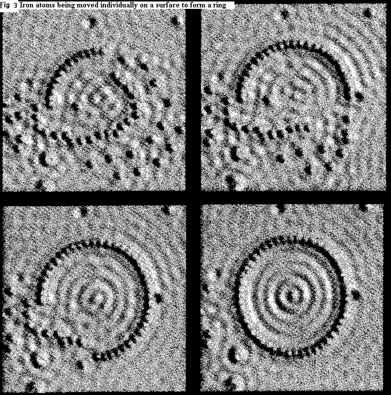
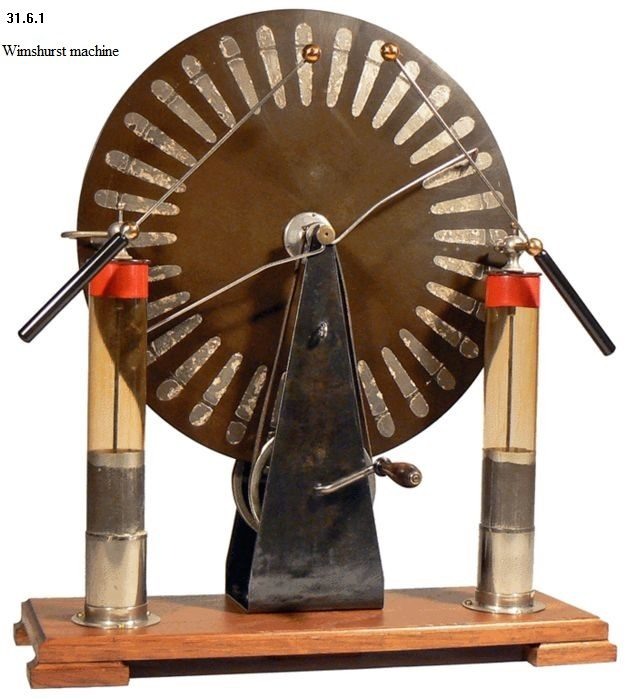
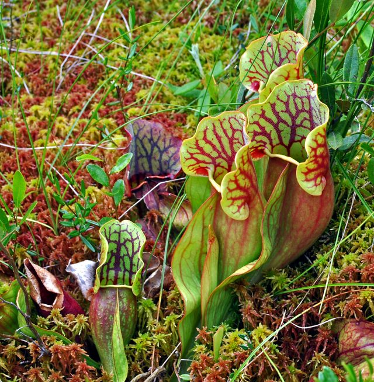
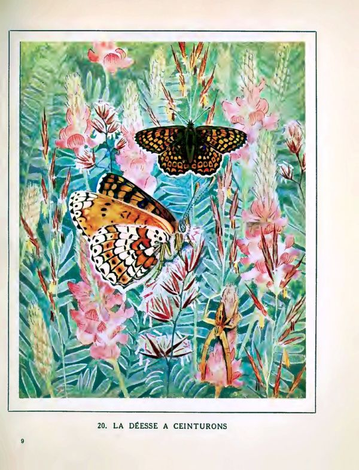
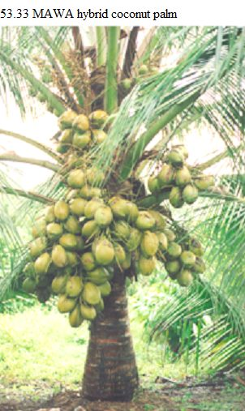
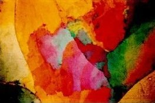
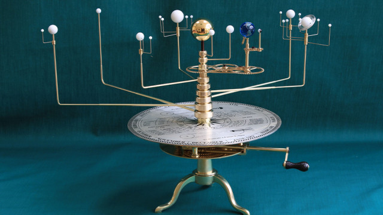
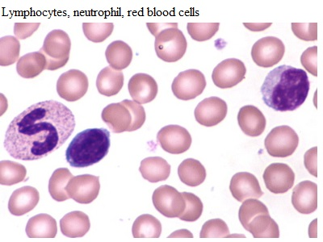
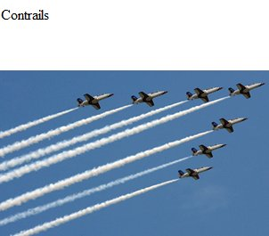

<h1>School Science Lessons</h1>

Thousands of classroom-tested science experiments and lessons
for primary and high schools — collected over decades by
Dr&nbsp;John&nbsp;Elfick, School of Education, University of Queensland.

  
<b>9,500+</b>numbered sections

  
<b>220+</b>chapters

  
<b>4,000+</b>diagrams

  <a class="ssl-card" href="topics/topicIndexAaAc/">
    

    
<b>Chemistry</b>Elements, compounds, reactions and preparations

  </a>
  <a class="ssl-card" href="physics/UNPhysicsTable/">
    

    
<b>Physics</b>Measurement, forces, electricity, light and sound

  </a>
  <a class="ssl-card" href="biology/UNBiologyTable/">
    

    
<b>Biology</b>Plants, animals, cells and ecology

  </a>
  <a class="ssl-card" href="primary/year1/">
    

    
<b>Primary science</b>Ready-to-teach lessons for Years 1–6

  </a>
  <a class="ssl-card" href="foodgardens/Foodgardens1/">
    

    
<b>Agriculture</b>Food gardens, crops and school projects

  </a>
  <a class="ssl-card" href="physics/UNPh35/">
    

    
<b>Geology &amp; Earth science</b>Rocks, minerals and the story of the Earth

  </a>
  <a class="ssl-card" href="physics/UNPh36/">
    

    
<b>Astronomy</b>The sky, the solar system and beyond

  </a>
  <a class="ssl-card" href="biology/UNBiology2/">
    

    
<b>Human physiology &amp; health</b>The human body, health and safety

  </a>
  <a class="ssl-card" href="physics/UNPh37/">
    

    
<b>Weather</b>Clouds, wind, rain and the sky above

  </a>

<h2 class="ssl-updates-title">Recently updated</h2>

Dr Elfick works on these lessons nearly every
day. The most recently revised pages:

<!-- BEGIN GENERATED UPDATES (written by build/emit.py --all) -->

<a class="ssl-update" href="biology/UNBiolN3S/"><time>12 Aug 2026</time>S, (Sabal to Syzygium)</a>
<a class="ssl-update" href="biology/UNBiolN3M/"><time>12 Aug 2026</time>M, (Macadamia to Myrsine)</a>
<a class="ssl-update" href="foodgardens/Foodgardens5b/"><time>12 Aug 2026</time>Australian native foods</a>
<a class="ssl-update" href="biology/UNBiolN3QR/"><time>11 Aug 2026</time>Genus names Q, R, Quararibea to Rubia</a>
<a class="ssl-update" href="biology/UNBiolN3PP/"><time>11 Aug 2026</time>Genus names P, (Picrasma to Pyrus)</a>
<a class="ssl-update" href="biology/UNBiolN3P/"><time>11 Aug 2026</time>Genus names P, (Pachira to Phytolacca)</a>
<a class="ssl-update" href="foodgardens/Foodgardens6/"><time>11 Aug 2026</time>Common names of plants, G to R</a>
<a class="ssl-update" href="websites/"><time>9 Aug 2026</time>Websites</a>
<a class="ssl-update" href="biology/UNBiolN3L/"><time>9 Aug 2026</time>Genus names L, (Lablab to Lythrum)</a>
<a class="ssl-update" href="biology/UNBiolN3IJK/"><time>9 Aug 2026</time>Genus names I, (Iberis to Kunzea)</a>
<a class="ssl-update" href="biology/UNBiolN3E/"><time>9 Aug 2026</time>Genus names E, (Ecballium to Fumaria)</a>
<a class="ssl-update" href="biology/UNBiolN3D/"><time>9 Aug 2026</time>Genus names D, (Dacrydium to Dysphania)</a>
<a class="ssl-update" href="biology/UNBiolN3C/"><time>9 Aug 2026</time>Genus names C, (Cabomba to Chrysopogon)</a>
<a class="ssl-update" href="biology/UNBiol1/"><time>8 Aug 2026</time>Plant anatomy</a>
<a class="ssl-update" href="biology/UNBiolN3T/"><time>8 Aug 2026</time>Genus names T, (Tabebuia to Typhonium)</a>
<a class="ssl-update" href="biology/UNBiolN3B/"><time>8 Aug 2026</time>Genus names B, (Baccaurea to Buxus)</a>
<a class="ssl-update" href="biology/UNBiolN3AA/"><time>8 Aug 2026</time>Genus names A, (Annona to Azadirachta)</a>
<a class="ssl-update" href="biology/UNBiolN3A/"><time>8 Aug 2026</time>Genus names A, (Abelia to Anisoptera)</a>
<a class="ssl-update" href="foodgardens/Foodgardens5a/"><time>8 Aug 2026</time>Common names of plants, A to F</a>
<a class="ssl-update" href="biology/UNBiologyTable/"><time>7 Aug 2026</time>Biology topics, common names, and genus names, A to Z</a>
<a class="ssl-update" href="biology/UNBiolN2NotFlow/"><time>6 Aug 2026</time>Non-flowering Plants</a>
<a class="ssl-update" href="biology/UNBiolN3N/"><time>6 Aug 2026</time>Genus names, N, (Nandina to Nyssa)</a>
<a class="ssl-update" href="biology/UNBiolN3H/"><time>6 Aug 2026</time>Genus names H, (Haematoxylon to Hyssopus)</a>
<a class="ssl-update" href="biology/UNBiolN3CC/"><time>6 Aug 2026</time>Genus names C, (Cicer to Cystisus)</a>
<a class="ssl-update" href="foodgardens/Foodgardens1/"><time>6 Aug 2026</time>Agriculture</a>
<a class="ssl-update" href="foodgardens/Foodgardens6a/"><time>5 Aug 2026</time>Common names of plants, S to Z</a>
<a class="ssl-update" href="foodgardens/Foodgardens5/"><time>1 Aug 2026</time>Agricultural crops</a>
<a class="ssl-update" href="biology/UNBiol8/"><time>31 Jul 2026</time>Bacteria</a>
<a class="ssl-update" href="projects/ProjHerb/"><time>29 Jul 2026</time>Herbs are easy to grow</a>
<a class="ssl-update" href="biology/UNBiolN3UZ/"><time>29 Jul 2026</time>Genus names U to Z</a>
<a class="ssl-update" href="topics/topicIndexAaAc/"><time>28 Jul 2026</time>Chemistry, Aa to Ac</a>
<a class="ssl-update" href="physics/UNPh36/"><time>28 Jul 2026</time>Astronomy</a>
<a class="ssl-update" href="appendices/appendixG/"><time>28 Jul 2026</time>Acacetin to Yuanhuacine</a>
<a class="ssl-update" href="biology/UNBiolDiversity/"><time>27 Jul 2026</time>Biodiversity</a>
<a class="ssl-update" href="biology/UNBiolN3F/"><time>26 Jul 2026</time>Genus names, F, (Fagopyrum to Fumaria)</a>
<a class="ssl-update" href="biology/UNBiolN3G/"><time>26 Jul 2026</time>Genus names G to H, (Gahnia to Gynura)</a>
<a class="ssl-update" href="projects/ProjBan/"><time>22 Jul 2026</time>Banana Project</a>
<a class="ssl-update" href="topics/topic18/"><time>20 Jul 2026</time>Chemistry of the Environment</a>
<a class="ssl-update" href="biology/UNBiolN3O/"><time>15 Jul 2026</time>Genus names O, (Ochna to Ozothamnus)</a>
<a class="ssl-update" href="projects/ProjSPot/"><time>3 Jul 2026</time>Sweet Potato Project</a>

<!-- END GENERATED UPDATES -->

!!! info "About this website"
    This website is generated automatically from
    <a href="https://johnelfick.github.io/school-science-lessons/" target="_blank" rel="noopener">the original School Science Lessons site</a>
    written and continuously updated by Dr John Elfick, and refreshes shortly
    after any change there. If anything looks wrong
    here, every page links back to its original version at the bottom.
    Historic imagery on this page is public domain — see
    [image credits](credits.md).

  <a href="https://johnelfick.goatcounter.com/" target="_blank" rel="noopener"
     title="Open the visitor statistics dashboard">
    
    Visitor statistics
  </a>

