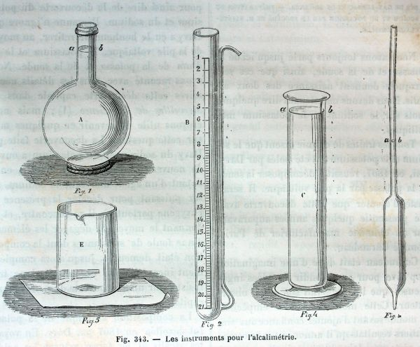
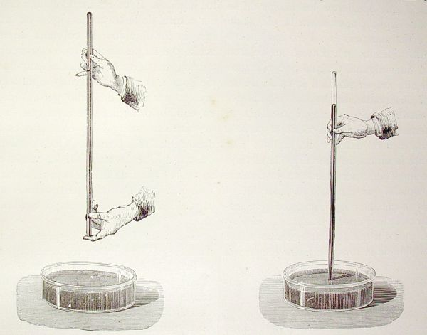
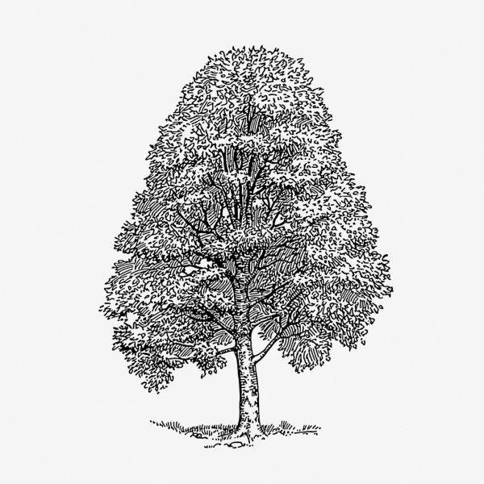
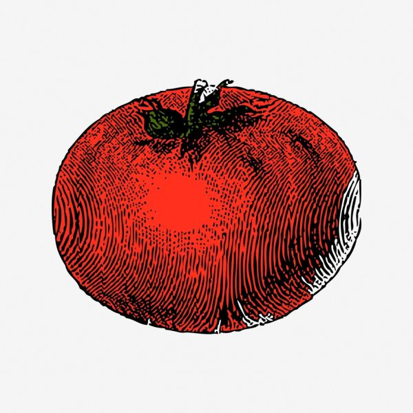
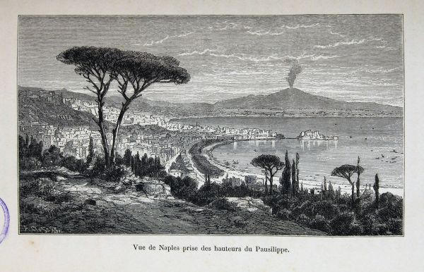
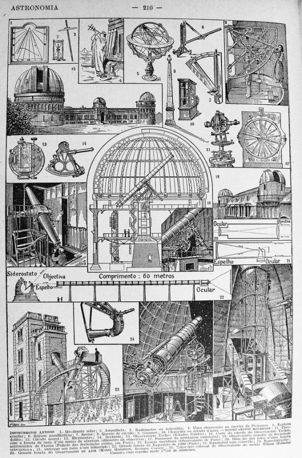
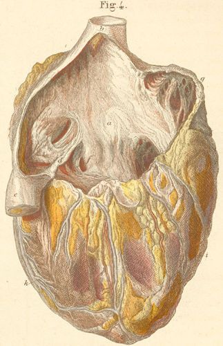

<h1>School Science Lessons</h1>

Thousands of classroom-tested science experiments and lessons
for primary and high schools — collected over decades by
Dr&nbsp;John&nbsp;Elfick, School of Education, University of Queensland.

  
<b>9,500+</b>numbered sections

  
<b>220+</b>chapters

  
<b>4,000+</b>diagrams

  <a class="ssl-card" href="topics/topicIndexAaAc/">
    

    
<b>Chemistry</b>Elements, compounds, reactions and preparations

  </a>
  <a class="ssl-card" href="physics/UNPhysicsTable/">
    

    
<b>Physics</b>Measurement, forces, electricity, light and sound

  </a>
  <a class="ssl-card" href="biology/UNBiologyTable/">
    

    
<b>Biology</b>Plants, animals, cells and ecology

  </a>
  <a class="ssl-card" href="primary/year1/">
    

    
<b>Primary science</b>Ready-to-teach lessons for Years 1–6

  </a>
  <a class="ssl-card" href="foodgardens/Foodgardens1/">
    

    
<b>Agriculture</b>Food gardens, crops and school projects

  </a>
  <a class="ssl-card" href="physics/UNPh35/">
    

    
<b>Geology &amp; Earth science</b>Rocks, minerals, weather and the Earth

  </a>
  <a class="ssl-card" href="physics/UNPh36/">
    

    
<b>Astronomy</b>The sky, the solar system and beyond

  </a>
  <a class="ssl-card" href="biology/UNBiology2/">
    

    
<b>Human physiology &amp; health</b>The human body, health and safety

  </a>

!!! info "About this website"
    This website is generated automatically every night from
    <a href="https://johnelfick.github.io/school-science-lessons/" target="_blank" rel="noopener">the original School Science Lessons site</a>
    written and continuously updated by Dr John Elfick. If anything looks wrong
    here, every page links back to its original version at the bottom.
    Historic imagery on this page is public domain — see
    [image credits](credits.md).
